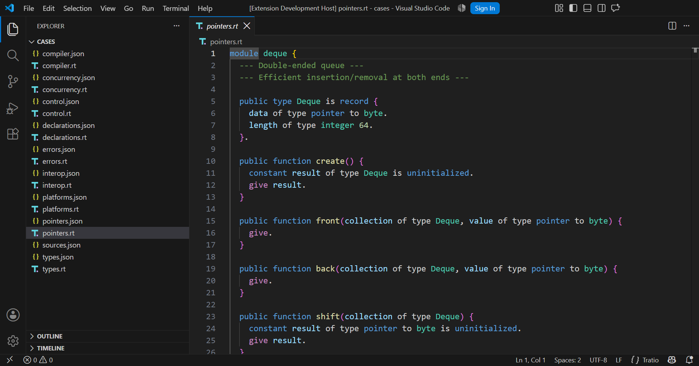

# Tratio for VS Code

Lexical highlighting and basic editing support for Tratio `.rt` files.
Language ID: `tratio`. TextMate scope: `source.tratio`.



This is an actual Extension Development Host screenshot using VS Code's stock
Dark Modern theme. `of type` and `to` are neutral, `pointer` is a modifier, and
`byte` is a primitive type. Themes choose the exact colors; this extension
contributes meaningful scopes, not a theme or color overrides.

## Install

In your normal VS Code window, run **Extensions: Install from VSIX**, select
`tratio-1.0.0.vsix`, and run **Developer: Reload Window**. `.rt` files should
then open as Tratio, with a file icon in the explorer and tab bar. An icon
theme that supplies its own `.rt` icon can override the language fallback.

To build the VSIX from this folder:

```sh
npm ci
npx --yes --omit=optional --package=@vscode/vsce@3.9.2 vsce package --no-dependencies --baseContentUrl=https://github.com/radiiplus/tratio/blob/v1.0.0/editors/textmate
code --install-extension tratio-1.0.0.vsix
```

For development, from the compiler repository root:

```sh
code --extensionDevelopmentPath="./editors/textmate" ./editors/textmate/test/cases/pointers.rt
```

Use **Developer: Inspect Editor Tokens and Scopes** to inspect the grammar.
Installing in an isolated test profile does not install in your normal profile.
In mixed projects with other `.rt` formats, use **Change Language Mode** or a
workspace association restricted to Tratio source directories. The extension
does not rewrite user settings. See the [collision audit](../../docs/editors/collision-audit.md).

## Language and scopes

The bundled pure-JSON grammar is [grammars/tratio.tmLanguage.json](grammars/tratio.tmLanguage.json).
It follows Tratio's lexer and [current specification](../../spec/grammar.md),
including `constant`, `mutable`, `function`, `give`, word operators, generics,
`derives`, `packed record`, C unions, attributes, and native escape blocks.

| Role | Scope family | Examples |
| --- | --- | --- |
| Type connective words | `meta.type.annotation.tratio` | `of type`, `of`, `to` |
| Primitive types | `support.type.primitive.tratio` | `byte`, `text`, `integer`, `decimal` |
| Type modifiers | `storage.modifier.type.tratio` | `pointer`, `reference`, `optional`, `fallible` |
| Type constructors | `storage.type.tratio` | `record`, `choice`, `vector`, `sequence` |
| Named types | `entity.name.type.tratio` | `Deque`, `Box`, `T` |

Comments use `--` and non-nesting `--- ... ---`. Text is single-line quoted
text; use `plus newline plus` to construct multiple lines. Supported text
escapes are `\n`, `\t`, `\r`, `\\`, `\"`, and `\0`; characters use single
quotes with `\'` instead of `\"`. Numbers are decimal integers or decimal-point
floats with underscores. A trailing dot terminates a statement.

Raw strings, multiline strings, hex/octal/binary numbers, and exponent notation
are not implemented by the current lexer and are not colored as supported
compound literals. The template's `let`, `fn`, and `return` remain identifiers.
Unterminated strings and invalid escapes receive `invalid.illegal.tratio`.

Documentation comments use the editor-only convention `--!` and
`---! ... ---`, with separate documentation scopes. The compiler currently
discards these as ordinary comments; documentation extraction has not been added.

Generic declaration brackets, `vector[...]`, and capitalized generic type uses
are approximated lexically. Type resolution, precise generic/index ambiguity,
and diagnostic reporting belong to the compiler/LSP. The native Zig body rules
are deliberately small. No LSP, activation script, custom settings, or theme
is bundled. The sole editor default enables bracket-pair colorization for Tratio.

## Tests and CI

```sh
npm ci
npm test
node tests/probe.mjs
npm run test:editor
```

The [fixture corpus](test/README.md) has nine construct families and full-line
scope assertions, including the complete 210-line self-hosted compiler.
There are 232 focused assertions, all 84 compiler keyword fixture lines, and
snapshots for 418 lines / 6,512 tokens. Every regex is compiled with Oniguruma.
Normal tests only compare snapshots; deliberate regeneration uses
`npm run snapshots`, followed by review of the diff.

The [GitHub Actions workflow](../../.github/workflows/grammar.yml) runs on every
push and pull request. It checks scopes, proves a corrupted assertion fails,
and runs the editor tests under Xvfb. Hosted CI runs when the commit is pushed;
local test results are not presented as a hosted CI run.

The editor harness downloads VS Code 1.96.4 into its test cache, or uses the
executable specified by the test-only `TRATIO_EDITOR` environment variable.
It creates fresh user-data and extension directories every time. It checks
language detection, comment toggles, bracket matching, auto-close/surround
pairs, indentation, word selection, token inspection, rendered type colors,
and SVG icons in both explorer and tabs. Screenshots and JSON evidence are
written to `.cache/evidence`. `TRATIO_THEME` can select another built-in theme
for verification; it is not an extension setting.

Local validation used a portable copy of VS Code 1.132.0. This allowed the
real editor gate to run despite the installed editor's stuck Windows updater.
The README screenshot comes from that isolated editor, not a mockup.

## Release pin

The requested release is the annotated Git tag `v1.0.0` in the current Tratio
repository. The grammar is at `editors/textmate/grammars/tratio.tmLanguage.json`
within that tree. Resolve the exact commit with `git rev-parse v1.0.0^{commit}`
when pinning a future Linguist submodule. Never move or recreate this release
tag; later grammar changes require a new version. Remote publication and tag
protection remain repository-maintainer actions; no remote was created or pushed.

The existing repository hosts the grammar and declarative extension together.
`publisher: tratio` is a local package identity, not a claim that a Marketplace
publisher has been registered. A separate remote grammar repository can later
preserve this release tree and its provenance.

## License and references

The grammar package, icons, fixtures, and screenshot are [MIT licensed](LICENSE).
See [CHANGELOG.md](CHANGELOG.md) for release changes.

Implementation references: [VS Code language contributions](https://code.visualstudio.com/api/references/contribution-points#contributes.languages),
[language configuration](https://code.visualstudio.com/api/language-extensions/language-configuration-guide),
and [TextMate scope conventions](https://macromates.com/manual/en/language_grammars#naming_conventions).
